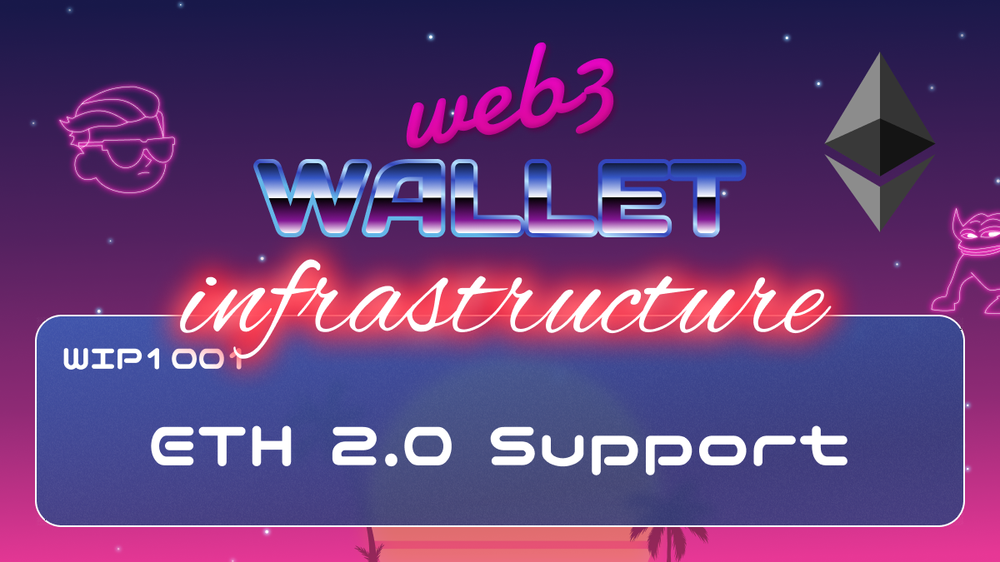

# WIP-1001 Post merge LES support

Currently, virtually all web3 products / dapps / wallets are connecting to 
crypto networks via centralized web2 node providers.

Web3 wallet is connecting to network via decentralized node provider 
[Pocket network](https://pokt.network/).

Endgame for problem of connecting to web3 in decentralized manner, at least for 
Ethereum, is stateless validators and [Portal Network](https://github.com/ethereum/portal-network-specs). 
This is not yet implemented, but it is on the road map and will be coming in 
future hard forks.  

In the meantime. The absolutely most decentralized way to connect to Ethereum is
[LES (Light Ethereum Subprotocol)](https://github.com/ethereum/devp2p/blob/master/caps/les.md).
Post merge support for LES should be coming in late october according to this
[Github issue](https://github.com/ethereum/go-ethereum/issues/25623#issuecomment-1238097540).
Goal of this proposal is to do any and all work on web3wallet side needed. Once 
done reach out to devs on LES team, see if there is anything we can do to 
help. Run earliest / beta version of LES as soon as possible.

Once work is completed, talk to devs if there is anything we can to help with
Portal network. Goal is to be first wallet that supports it. Have supports for 
early dev versions of Portal network client.

