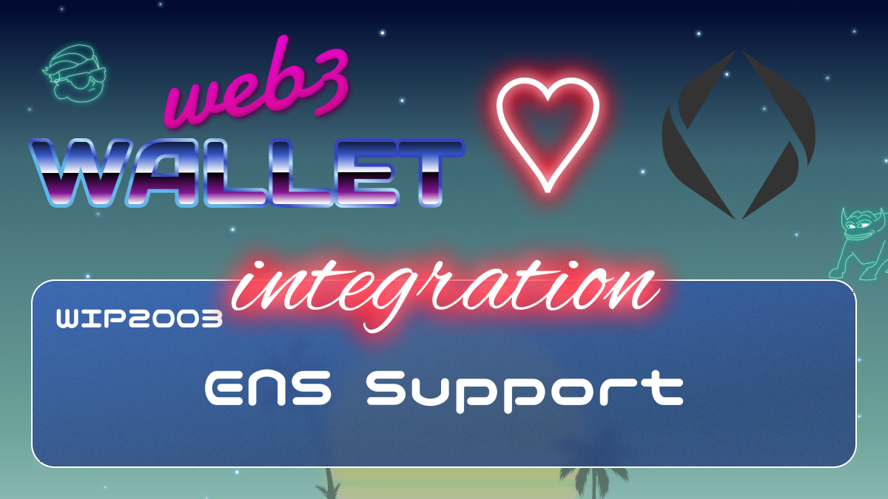

[_metadata_:at_account]:- "@ensdomains"

# WIP-2003 ENS integration

The Ethereum Name Service (ENS) is a distributed, open, and extensible naming system based on the Ethereum blockchain.
ENS’s job is to map human-readable names like ‘alice.eth’ to machine-readable identifiers such as Ethereum addresses, other cryptocurrency addresses, content hashes, and metadata. ENS also supports ‘reverse resolution’, making it possible to associate metadata such as canonical names or interface descriptions with Ethereum addresses.
ENS has similar goals to DNS, the Internet’s Domain Name Service, but has significantly different architecture due to the capabilities and constraints provided by the Ethereum blockchain. Like DNS, ENS operates on a system of dot-separated hierarchical names called domains, with the owner of a domain having full control over subdomains.
Top-level domains, like ‘.eth’ and ‘.test’, are owned by smart contracts called registrars, which specify rules governing the allocation of their subdomains. Anyone may, by following the rules imposed by these registrar contracts, obtain ownership of a domain for their own use. ENS also supports importing in DNS names already owned by the user for use on ENS.
Because of the hierarchal nature of ENS, anyone who owns a domain at any level may configure subdomains - for themselves or others - as desired. For instance, if Alice owns 'alice.eth', she can create 'pay.alice.eth' and configure it as she wishes.
ENS is deployed on the Ethereum main network and on several test networks. If you use a library such as the  Javascript library, or an end-user application, it will automatically detect the network you are interacting with and use the ENS deployment on that network.
You can try ENS out for yourself now by using the, or by using any of the many ENS enabled applications.