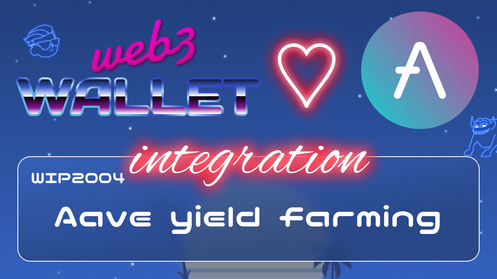

[_metadata_:at_account]:- "@AaveAave"

# WIP-2004 Aave yield farming

Aave is a decentralized non-custodial liquidity protocol where users can participate as depositors or borrowers. Depositors provide liquidity to the market to earn a passive income, while borrowers are able to borrow in an overcollateralized (perpetually) or undercollateralized (one-block liquidity) fashion.