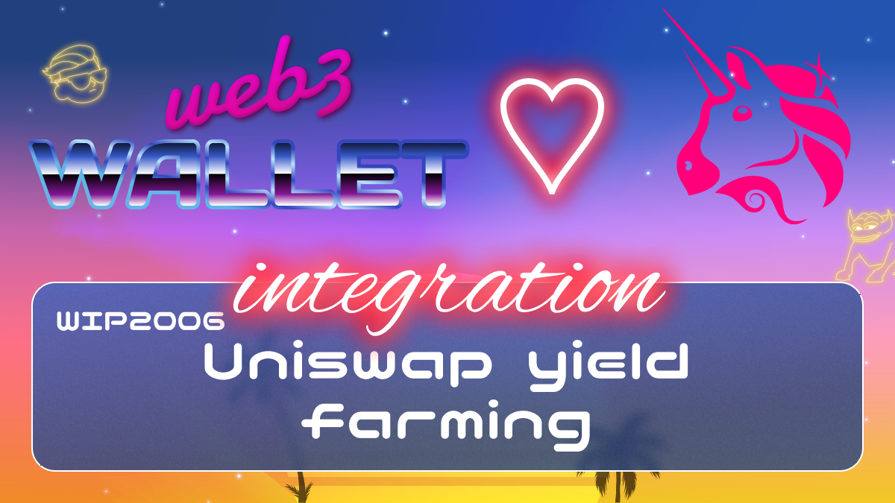

[_metadata_:at_account]:- "@Uniswap"

# WIP-2006 Uniswap yield farming

Uniswap v3 is a noncustodial automated market maker implemented for the Ethereum Virtual Machine. In comparison to earlier
versions of the protocol, Uniswap v3 provides increased capital
efficiency and fine-tuned control to liquidity providers, improves
the accuracy and convenience of the price oracle, and has a more
flexible fee structure.