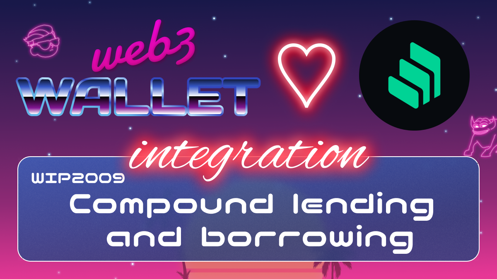

[_metadata_:at_account]:- "@compoundfinance"

# WIP-2009 Compound lending and borrowing

Compound is a protocol on the Ethereum blockchain that establishes money markets, which are
pools of assets with algorithmically derived interest rates, based on the supply and demand for the
asset. Suppliers (and borrowers) of an asset interact directly with the protocol, earning (and paying) a floating interest rate, without having to negotiate terms such as maturity, interest rate, or collateral with a peer or counterparty. Each money market is unique to an Ethereum asset (such as Ether, an ERC-20 stablecoin such as Dai, or an ERC-20 utility token such as Augur), and contains a transparent and publicly-inspectable ledger, with a record of all transactions and historical interest rates.