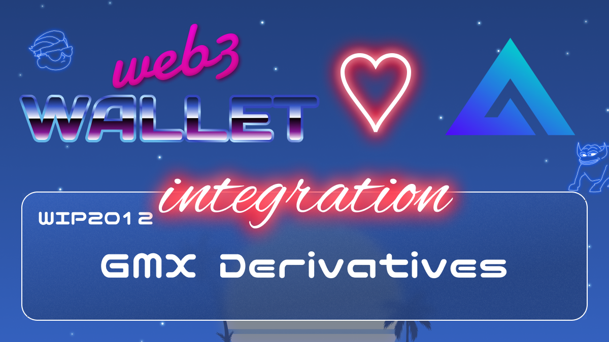

[_metadata_:at_account]:- "@GMX_IO"

# WIP-2012 GMX Derivatives

GMX is a decentralized spot and perpetual exchange that supports low swap fees and zero price impact trades.
Trading is supported by a unique multi-asset pool that earns liquidity providers fees from market making, swap fees and leverage trading.
Dynamic pricing is supported by Chainlink Oracles and an aggregate of prices from leading volume exchanges.
