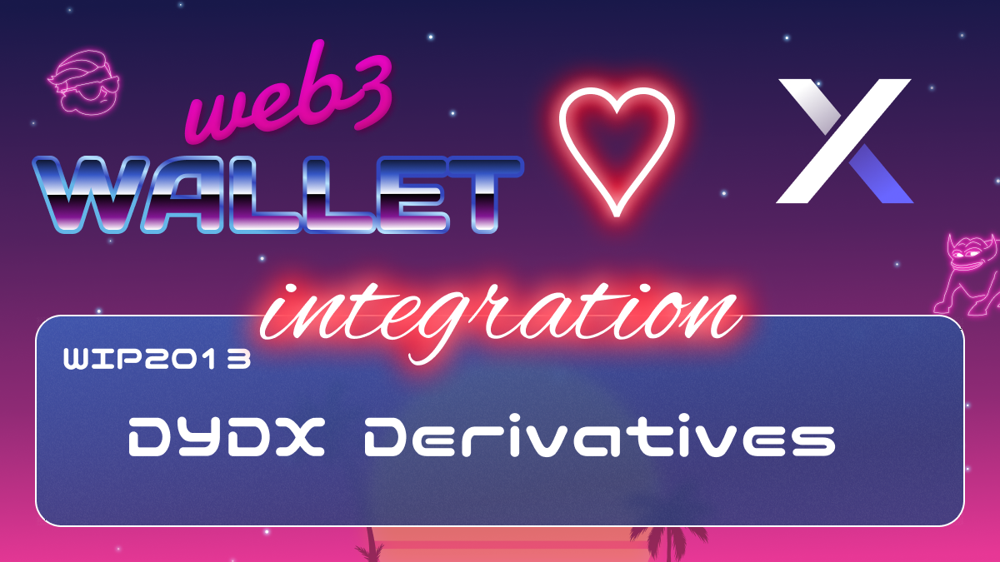

# WIP-2013 DYDX Derivatives

dYdX is a leading decentralized exchange that currently supports perpetual trading. dYdX runs on smart contracts on the Ethereum blockchain, and allows users to trade with no intermediaries.

Perpetuals trading with up to 20x leverage

Pairs offered: BTC-USD, ETH-USD, LINK-USD, and more