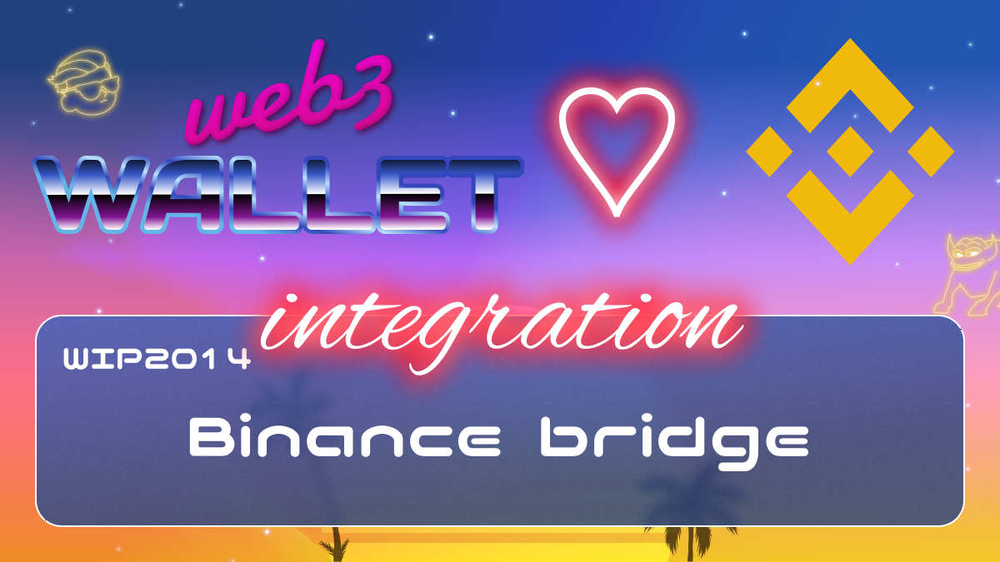

[_metadata_:at_account]:- "@binance"

# WIP-2014 Binance bridge

Binance Bridge 2.0 introduces a new way to bridge listed and selected unlisted tokens from Ethereum to BNB Smart Chain as BTokens. You can use your wrapped tokens with the BNB Chain ecosystem and explore DeFi, blockchain games, metaverse, and more. 
Binance Bridge 2.0 is a trusted bridge protected by the highest security standards of Binance, operating on the BNB Smart Chain with low fees of only a few cents and fast transaction times of just 3 seconds. Binance Bridge 2.0 will support almost all Ethereum-native tokens and give you direct access to BNB Smart Chain dApps such as the most-used dApp globally – PancakeSwap. Support for more blockchains and dApps is coming in the future. 