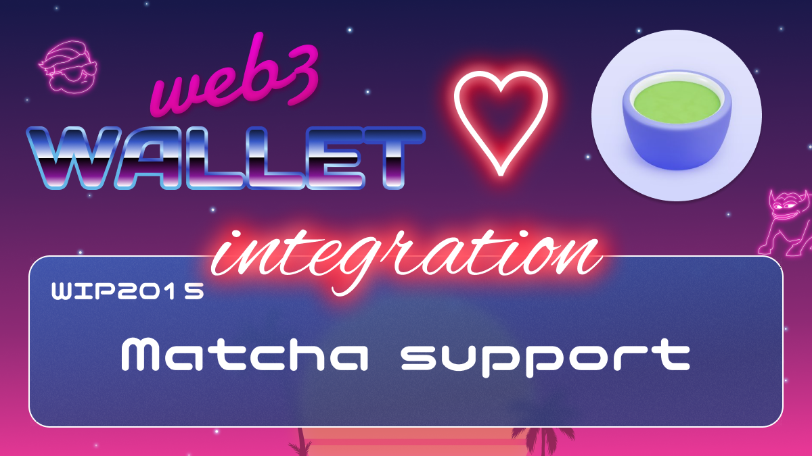

[_metadata_:at_account]:- "@matchaxyz"

# WIP-2015 Matcha Dex aggregator

Matcha is a crypto trading platform powered by 0x Labs. We are a decentralized exchange, or DEX, meaning that users swap their tokens peer-to-peer through the Ethereum smart contract infrastructure. You retain complete custody of your tokens throughout the entire trading process.

We also aggregate the best prices across a growing number of liquidity sources to maximize the value you receive on every trade. Also, unlike some other DEX aggregators, Matcha transparently displays all costs/fees associated with trades, and we will never keep the difference between quoted and realized price