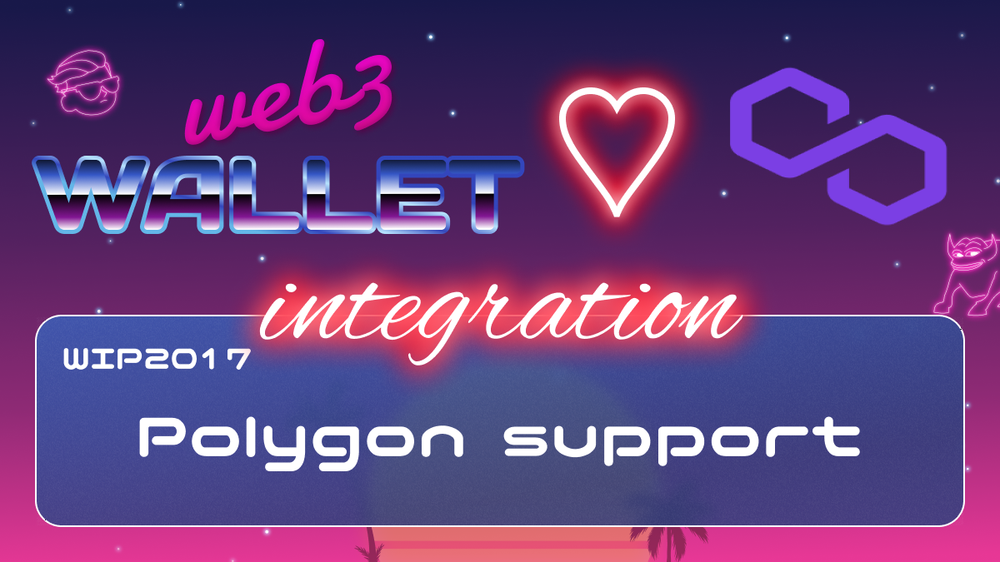

[_metadata_:at_account]:- "@0xPolygon"

# WIP-2017 Polygon

Polygon is a blockchain application platform that provides hybrid Proof-of-Stake and Plasma-enabled sidechains.

Architecturally, the beauty of Polygon is its elegant design, which features a generic validation layer separated from varying execution environments like Plasma enabled chains, full-blown EVM sidechains, and in the future, other Layer 2 approaches such as Optimistic Rollups.

The Polygon PoS Network has a three-layer architecture:

Ethereum layer — a set of contracts on the Ethereum mainnet.
Heimdall layer — a set of proof-of-stake Heimdall nodes running parallel to the Ethereum mainnet, monitoring the set of staking contracts deployed on the Ethereum mainnet and committing the Polygon Network checkpoints to the Ethereum mainnet. Heimdall is based on Tendermint.
Bor layer — a set of block-producing Bor nodes shuffled by Heimdall nodes. Bor is based on Go Ethereum.