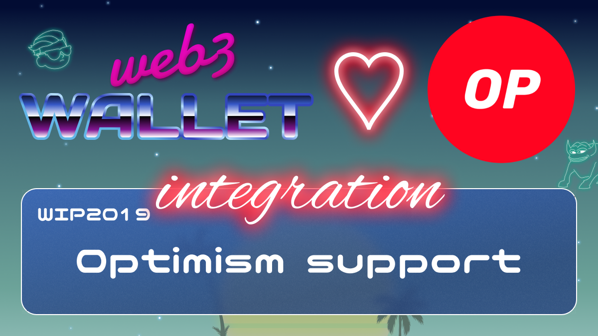

[_metadata_:at_account]:- "@optimismFND"

# WIP-2019 Optimism

Optimism is a fast, stable, and scalable L2 blockchain built by Ethereum developers, for Ethereum developers. Built as a minimal extension to existing Ethereum software, Optimism’s EVM-equivalent architecture scales your Ethereum apps without surprises. If it works on Ethereum, it works on Optimism at a fraction of the cost.
