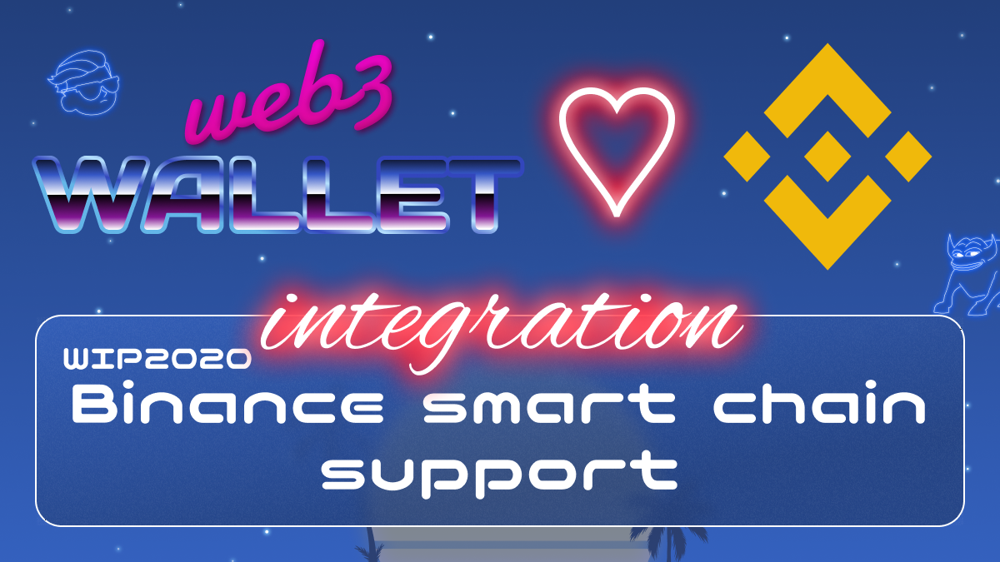

[_metadata_:at_account]:- "@binance"

# WIP-2020 Binance smart chain

BNB Chain’s mission is to build the infrastructure powering the world’s parallel virtual ecosystem, and BNB Chain’s commitment to the community is that it will be: 

Open

Multi-chain

For creators and inventors

Permissionless

Forever decentralized

And bigger than Binance

BNB Chain is comprised of:

BNB Beacon Chain (previously Binance Chain) - BNB Chain Governance (Staking, Voting)

BNB Smart Chain (BSC) (Previously Binance Smart Chain) - EVM compatible, consensus layers, and with hubs to multi-chains