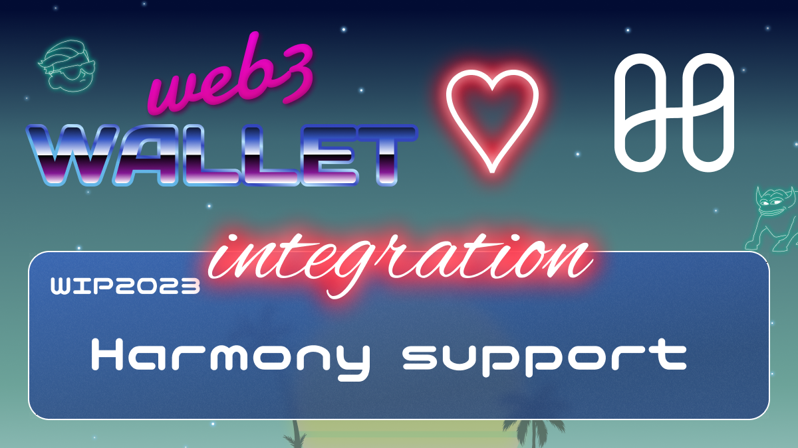

# WIP-2023 Harmony

Harmony is a next generation sharding-based blockchain that is fully scalable,
provably secure, and energy efficient. Harmony addresses the problems of existing blockchains by
combining the best research results and engineering practice in an optimally tuned system.

Harmony provides the world with a scalable and secure blockchain system that is able to support the emerging decentralized economy. Harmony will enable applications which were not previously feasible on blockchain, including high-volume decentralized exchanges, interactive fair games, Visa-scale payment systems, and Internet-of-Things transactions. Harmony strives to scale trust for billions of people and create a radically fair economy.
