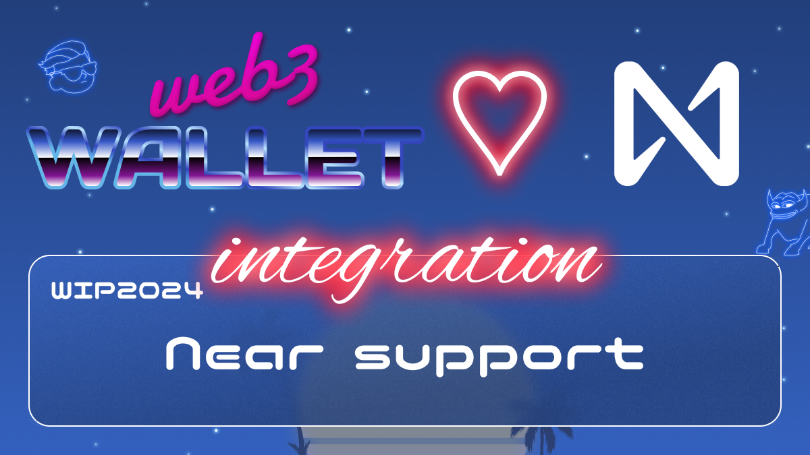

[_metadata_:at_account]:- "@NEARProtocol"

# WIP-2024 Near

NEAR is a decentralized application platform which runs atop the NEAR Protocol blockchain.  This blockchain, which runs across hundreds of machines around the world, is organized to be permissionless, performant and secure enough to create a strong and decentralized data layer for the new web.

Essentially, NEAR is a platform for running applications which have access to a shared — and secure — pool of money, identity and data which is owned by their users.  More technically, it combines the features of partition-resistant networking, serverless compute and distributed storage into a new kind of platform.