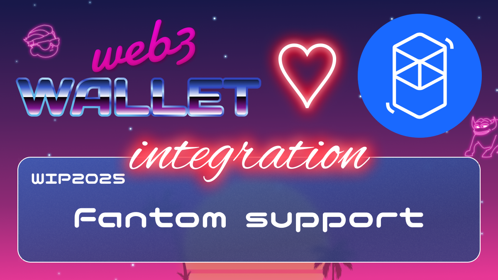

[_metadata_:at_account]:- "@FantomFDN"

# WIP-2025 Fantom

Fantom is a high-performance, scalable, EVM-compatible, and secure smart-contract platform.

Fantom’s mainnet deployment—Fantom Opera—is built on Fantom’s consensus mechanism, Lachesis. Fantom is a leaderless, asynchronous, and byzantine fault-tolerant Layer 1 blockchain protocol.

Lachesis enables Fantom to deliver fast transaction speeds, low transaction costs, and deterministic finality. This is achieved while remaining permissionless, decentralized, and open-source.