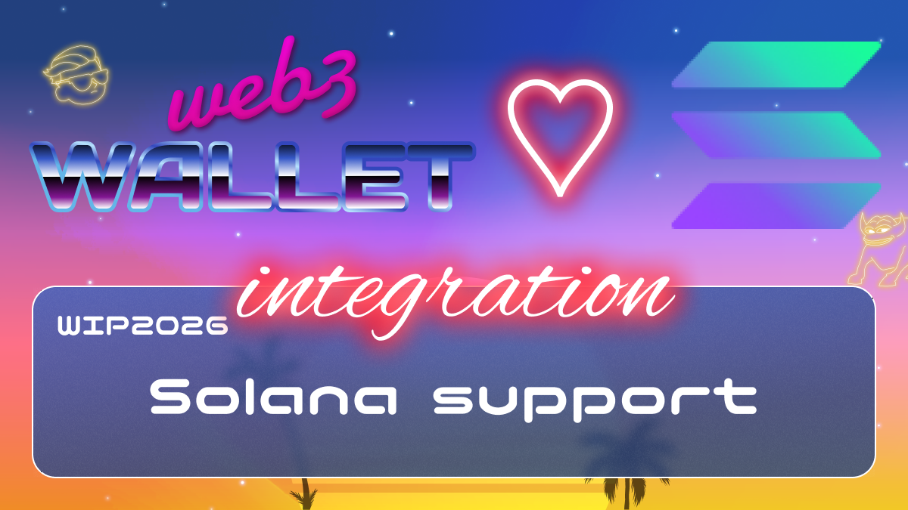

[_metadata_:at_account]:- "@solana"

# WIP-2026 Solana

Solana is an open source project implementing a new, high-performance, permissionless blockchain. The Solana Foundation is based in Geneva, Switzerland and maintains the open source project.
Solana is the fastest blockchain in the world and the fastest growing ecosystem in crypto, with thousands of projects spanning DeFi, NFTs, Web3 and more.