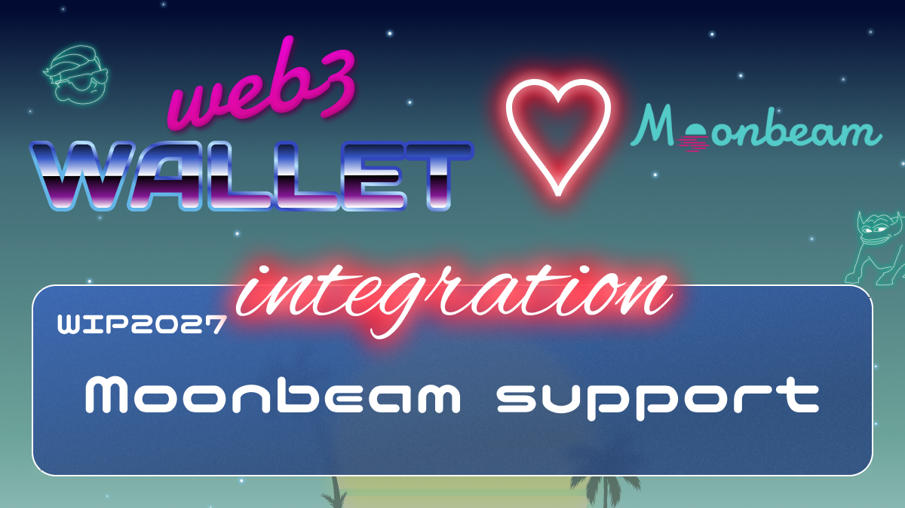

# WIP-2027 Moonbeam

Moonbeam is much more than just an EVM implementation: it’s a highly specialized Layer 1 chain that mirrors Ethereum’s Web3 RPC, accounts, keys, subscriptions, logs, and more. The Moonbeam platform extends the base Ethereum feature set with additional features such as on-chain governance, staking, and cross-chain integrations.