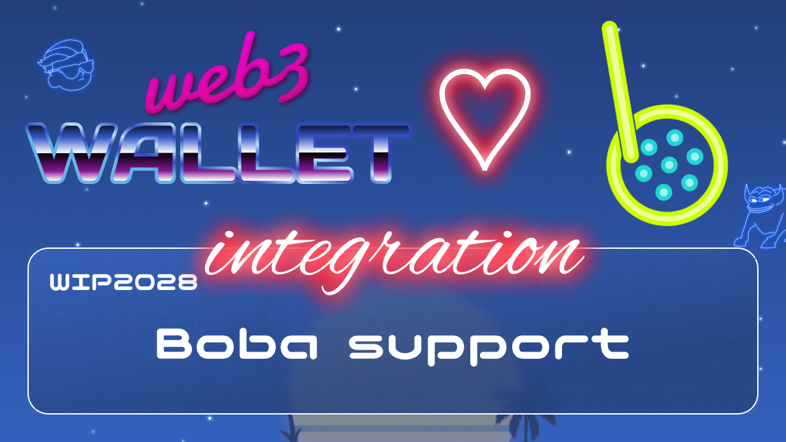

[_metadata_:at_account]:- "@bobanetwork"

# WIP-2028 boba

Boba offers fast exits backed by community-driven liquidity pools, shrinking the Optimistic Rollup exit period from seven days to only a few minutes, while giving LPs incentivized yield farming opportunities.

Boba’s extensible smart contracts will enable developers across the Ethereum ecosystem to build dApps that invoke code executed on web-scale infrastructure such as AWS Lambda, making it possible to use algorithms that are either too expensive or impossible to execute on-chain.

Boba Network aspires to be the People’s L2 that puts users and developers first. The goal is to build a pragmatic L2 that is the first step towards opening Ethereum to the next Billion users. Boba is an L2 Ethereum scaling & augmenting solution built by the Enya team as core contributors to the Boba Foundation.
